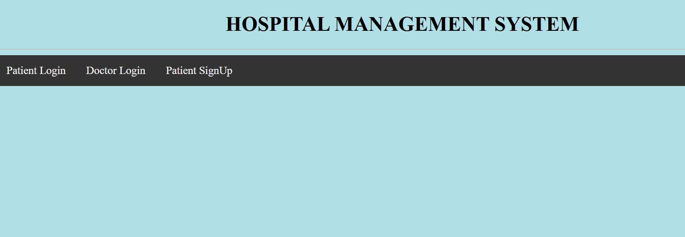
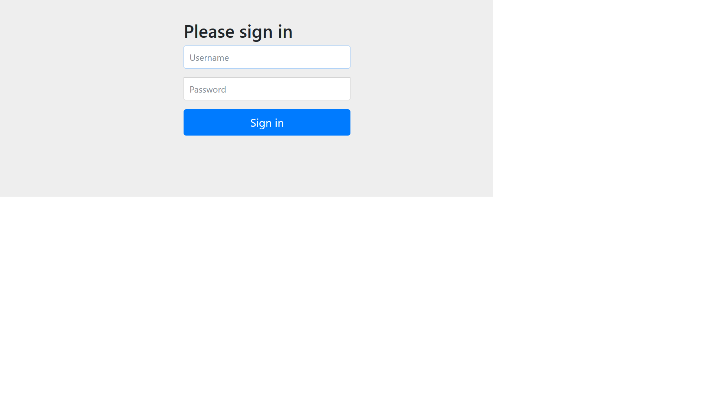
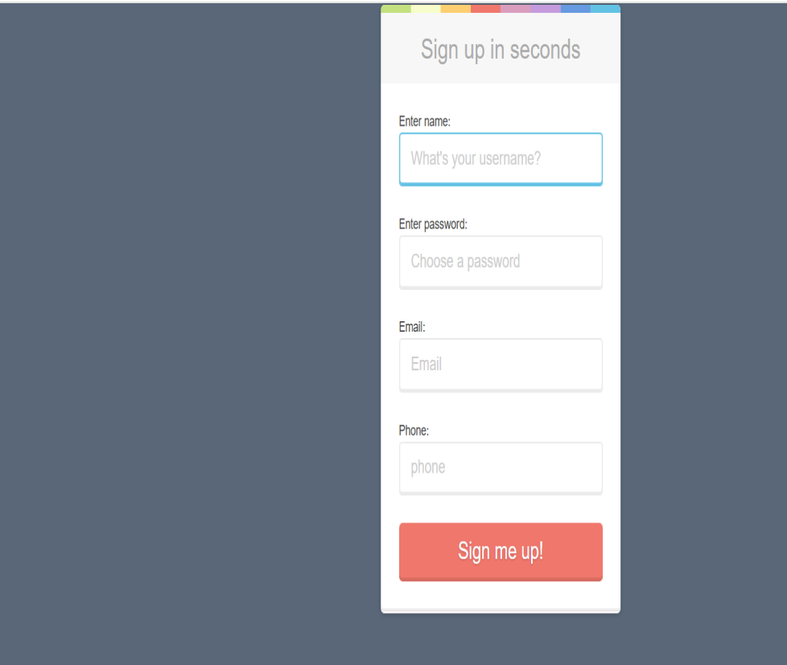
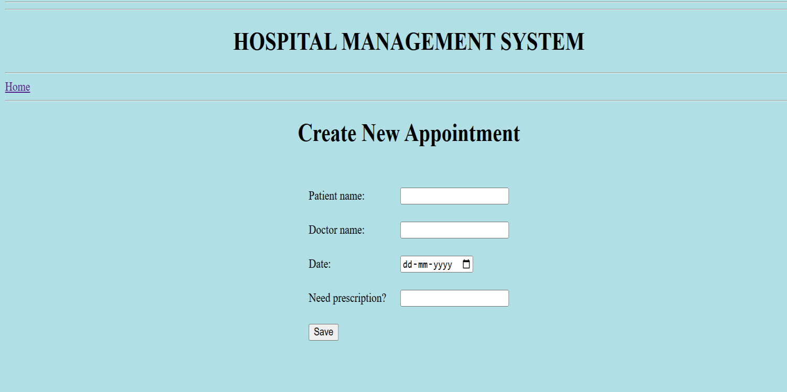
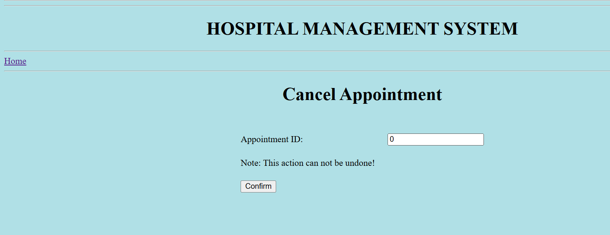
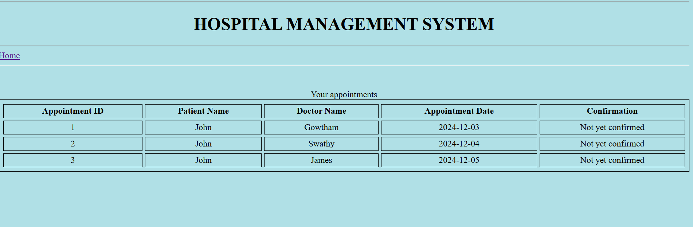
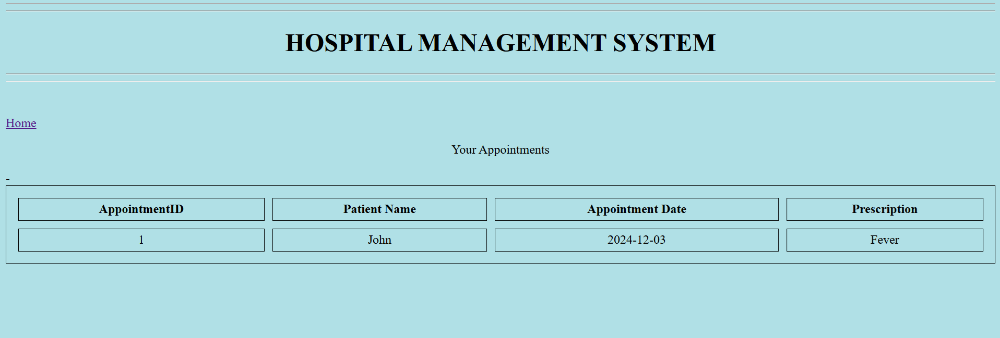

# Project Title:

Hospital Management (CRUD) System

## 1. Project Description:

A Spring MVC web application for Hospital Management System with the following operations:

- Display Doctor Dashboard
- List of doctor appoinments
- Display Patient Dashboard
- Form to book an appoinment by selecting doctor and time slot.
- Form to cancel the appoinment


## 2. Tech Stack:

- Java 17
- Spring Boot
- HTML
- Bootstrap
- Thymeleaf
- Spring MVC
- Spring Data JPA
- Hibernate
- Maven 
- MySql database


## 3. Installing:

i. Clone the git repo

```
https://github.com/AAdewunmi/SpringBoot-Employee-Management-System.git
```

ii. Open project folder

iii. Explore


## 4. How To Use:

i. Create Database -> demo

ii. Open project in preferred IDE (I used SpringToolsSuite4) 

iii. Run project as Spring Boot App

iv. Hibernate will automatically create a table -> employee

v. Add sample data to table using MySQL Workbench Client

vi. Open web app at localhost: 8080/

vii. Add, Update and Delete records from web app 


## 5. Demo:

### - Main Dashboard UI



### - Login UI



### - Signup UI



### - Create Appointments UI



### - Cancel Appointments UI



### - View Appointments UI



### - Doctor Appointments UI




## 6. Original Creator:

Author: Gowtham Kanagaraj
 
Github Project Name: Hospital Management System

Github URL: https://github.com/RameshMF/springboot-thymeleaf-crud-pagination-sorting-webapp
